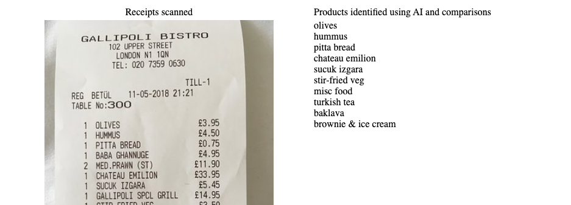

# Receipt product extractor
App demonstrating pulling purchased products from scanned recipts based on already classified products. Future improvments could be to support more recipts formats and international versions as well as getting the product with quantiy and unit price per line item.

## Spin up for local testing
* Ensure docker with docker-compose are installed and running
* Add Google Cloud Vision credentials to project root in a file named: `gcloud_credentials.json`
* Open terminal in project root and run `docker-compose up`
* Docker will pull, build and start the container
* Access web client on: http://localhost:80
* Once the web client is accessed the receipts are scanned and result shown.

## Stack
* Server: Node.js, Expressjs
* Argeitchture: MVC
* AI/ML: Google Cloud Vision 
* Regression testing: Jest
* Web Client: HTML & CSS
* DevOps: Docker
